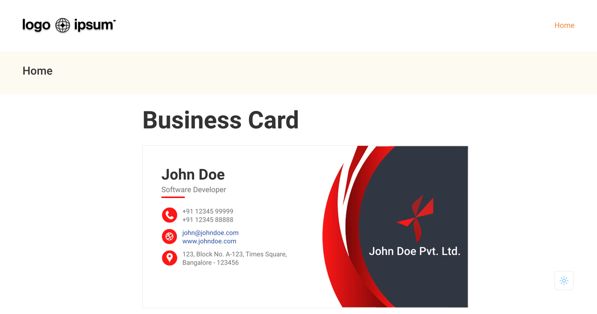

# Business Card using `fastn`

In this fastn package you will find a business card.



## What Is `fastn`

`fastn` is a simple programming language for building user interfaces and 
websites. `fastn` is optimised for ease of learning, and even non 
programmers can learn it in a day.

Learn more about `fastn`: [fastn-stack/fastn](https://github.com/fastn-stack/fastn), and join our [Discord community](https://fastn.com/discord/).

## How To Run This Project

Install `fastn` on Mac/Linux using:

```sh
curl -fsSL https://fastn.com/install.sh | bash
```

For windows download our [fastn_setup.exe](https://github.com/fastn-stack/fastn/releases/latest) from latest `fastn` release and 
run it.

Once you have `fastn` installed you can run:

```shell
fastn serve
```

And check your website on `http://127.0.0.1:8000`.
